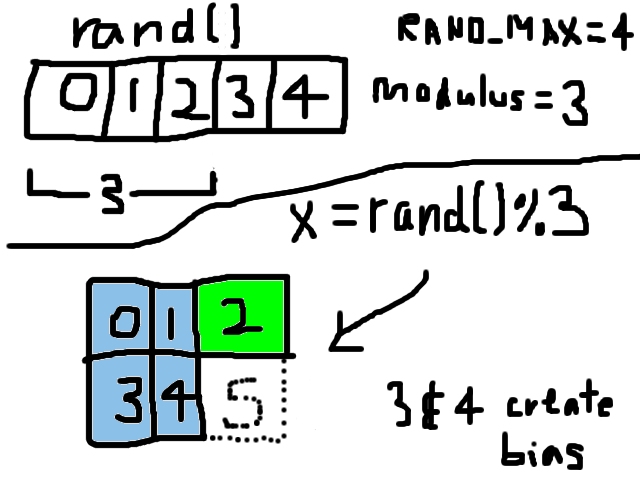

Summary: If `(RAND_MAX + 1) % n != 0`, you have modulo bias. Fix it!

Let's say you need a random number from 0 to 2 (0, 1, or 2). If you do this:

```{.c .numberLines}
/* Listing 1 */
int n, x;
n = 3;
x = rand() % n;
return x;
```

your code is broken, thanks to modulo bias. You will always get modulo bias (however slight, or great, it may be) whenever `RAND_MAX + 1` of your `rand()` function is not evenly divisible by your modulus `n`.

Continuing with our example, let's say `rand()`'s `RAND_MAX` is 4, so there are 5 different possible values that `rand()` can generate (0, 1, 2, 3, or 4).
Now rand() will return each value 20% of the time, assuming that `rand()` has very good distribution from 0 to `RAND_MAX`.[^rng_dist]
But since we take the modulo by 3, **we get 0 40% of the time (0 and 3)!**
This fact alone should make you worried.
Visually it is as follows:



The following code is correct:

```{.c .numberLines}
/* Listing 2 */
int n, x, rand_limit, rand_excess;
n = 3;
rand_excess = (RAND_MAX + 1) % n;
rand_limit = RAND_MAX - rand_excess;
while (x = rand() > rand_limit) {};
return x % n;
```

So, if `RAND_MAX` is 4 as in the previous example, `rand_excess` is
$$
(4 + 1) \mbox{ mod 3}\\
= 5 \mbox{ mod 3}\\
= 2
$$.
Then `rand_limit` becomes $4 - 2 = 2$. The `while` statement then throws out the values 3 and 4 (i.e., x is only allowed to be 0, 1, or 2).
Then, we return the modulo expression `x % n` (which is redundant here onlyu because `RAND_MAX` is very low for the sake of our example).

A problem might exist if `RAND_MAX` is already the maximum value allowed by the type that `rand()` returns.
E.g., if `rand()` returns a 64-bit unsigned integer (in C99, this is the `uint64_t` type) , and `RAND_MAX` is already set to $2^{64} - 1$, then `RAND_MAX - 1` would wrap back around to 0, and `rand_excess` would likewise be 0.
To avoid this, you can use the alternate expression for setting `rand_excess`:

```{.c .numberLines}
/* Listing 3 */
...
rand_excess = (RAND_MAX % n) + 1;
...
```

This way, you ensure that you shrink the value of `RAND_MAX` to something smaller first, before adding 1 to it as in Listing 2.
Unfortunately, there still remains a problem with this workaround: there is a remote chance that `rand_excess` will be equal to `n`, needlessly reducing the size of `rand_limit` (and thus throwing away perfectly bias-free numbers generated by `rand()`).
For example, say `RAND_MAX` is 8 and `n` is 3.
Then `rand_excess` is
$$
(8 \mbox{ mod 3}) + 1\\
= 2 + 1\\
= 3
$$.
Now `rand_limit` is $8 - 3 = 5$.
But `RAND_MAX` of 8 is already valid because there are 9 possible values 0 through 8, and there is no modulo bias to begin with (since $9 \mbox{ mod 3} = 0$)!
To get around this, we can do one more modulo operation to avoid the case where `rand_excess` could equal `n`:

```{.c .numberLines}
/* Listing 4 */
...
rand_excess = ((RAND_MAX % n) + 1) % n;
...
```

So if `RAND_MAX` is 8 and `n` is 3, then `rand_excess` is
$$
((8 \mbox{ mod 3}) + 1) \mbox{ mod 3}\\
= (2 + 1) \mbox{ mod 3}\\
= 3 \mbox{ mod 3}\\
= 0
$$
and `rand_limit` would not be reduced by any amount.[^stanislav]

If you actually know beforehand the exact size of `RAND_MAX` (usually it is `INT_MAX` or some such, determined by the type of the variable returned by `rand()`), you should instead just define `rand_limit` as a constant to save some CPU cycles (write out the mathematical expressions involved by hand to find the number and just hardcode it).

[^rng_dist]: All modern `rand()` functions should have very good distribution.
[^stanislav]: Thanks to Stanislav Tsyganov for this improvement over Listing 3.
